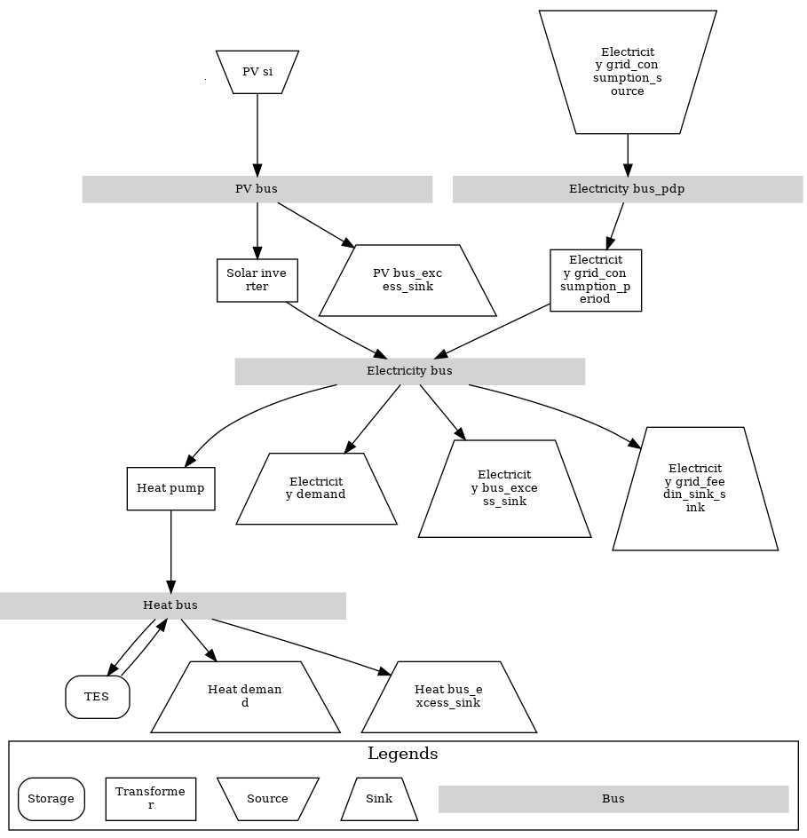

.. _basic_usage:

Basic usage of pvcompare
~~~~~~~~~~~~~~~~~~~~~~~~

.. _run_simulation:

Run a simulation
================

You can easily run a simulation by executing one of the examples in `examples/ <https://github.com/greco-project/pvcompare/tree/master/examples>`_.
There are three examples, one that accounts only for the electricity sector, one for sector coupling using heat pumps and one example covering heat demand with a gas plant as a reference scenario for the one with heat pumps.

Here's an example energy system graph of a sector coupled scenario of the simulation provided in ``examples/run_pvcompare_example_sector_coupling.py``.

    Energy system graph of an examplary sector coupled energy system.

If you want to set up your own scenario, you need to insert input files into the directory first. How to do this is described in the next paragraph :ref:`define_params`.
Afterwards you can run a simulation by running the file `run_pvcompare.py <https://github.com/greco-project/pvcompare/blob/master/run_pvcompare.py>`_ in the parent folder of *pvcompare*.
In order to run a simulation you need to at least define the following parameters:

- latitude: float
- longitude: float
- year: int
- storeys: int
- country: str
- scenario_name: str

.. _define_params:

Define your own components and parameters
=========================================

*pvcompare* provides you with templates and default parameters for your simulations. You can find three basic scenarios (for the electricity sector, sector coupled system and a reference for the sector coupled system) in ``examples/example_user_inputs/``.
A full description of the parameters and default values can be found in the section :ref:`parameters`.
However, you can also define your own energy system, choose different parameters and/or change the settings.

You can configure your own scenario by defining the parameters in ``data/user_inputs``. It contains two subfolders ``mvs_inputs`` for all MVS parameters and ``pvcompare_inputs`` for *pvcompare* inputs parameters. You can define a different input directory by providing the parameters ``user_inputs_mvs_directory`` and ``user_inputs_pvcompare_directory`` to the :py:func:`~.apply_pvcompare` and :py:func:`~.apply_mvs` functions.
Please note that *pvcompare* only works with csv files but not with `json files <https://multi-vector-simulator.readthedocs.io/en/latest/simulating_with_the_mvs.html#json-file-mvs-config-json>`_.

Because the ``data/user_inputs`` folder is an individual working directory, it is left empty in the initial state of *pvcompare*. The user is required to fill in the specific input files that fit to the according energy system setup.
The directory ``data/user_inputs_collection`` contains a collection of all kinds of possible asset definitions that have been used within the GRECO Project. Users are welcome to copy specific parts
from this collection folder into the ``data/user_inputs`` files. It is also possible to define new MVS assets (e.g. different power plants, storages or energy providers, transformers etc.). Please see the `MVS documentation on simulating with the MVS <https://multi-vector-simulator.readthedocs.io/en/latest/simulating_with_the_mvs.html>`_ for more information.
When setting up your input files, make sure that your individual input folder contains *all* available files. Even though you can change the values of the parameters, the files themselves, their naming and structure cannot be changed.

There are three input folders  (one for each example) in the ``examples/example_user_inputs/`` directory that resemble specific scenario setups for
sector coupled and electricity sector scenarios. For a start we recommend to study the example input files and then set up your own input files accordingly by adding (or removing) components from the ``data/user_inputs_collection`` directory.

The following list gives an overview over all user input files. See section :ref:`parameters` for more information.

**pvcompare_inputs**

- ``pv_setup.csv``: Definition of PV assets (technology, tilt angle, azimuth angle, roof-top or facade installation)
- ``building_parameters.csv``: Definition of characteristics of the building type that should be considered in the simulation
- ``heat_pumps_and_chillers.csv``: Definition of characteristics of the heat pump and chiller for the calculation of the COP/EER
- ``stratified_thermal_storage.csv``: Definition of characteristics of the stratified thermal energy storage for the calculation of thermal energy losses from the storage to the environment

**mvs_inputs/csv_elements**

- ``constraints.csv``: List of contraints that should be activated for the energy system optimization (such as Net Zero Energy (NZE) constraint)
- ``economic_data.csv``: General information about the simulation (currency, project duration, discount factor)
- ``energyBusses.csv``: Definition of connecting busses (e.g. one electricty and one heat bus in a sector coupled scenario)
- ``energyConsumption.csv``: Definition of the energy demand (e.g. electricity demand and/or heat demand with the filename of the demand time series)
- ``energyConversion.csv``: Definition of transformers (e.g. solar inverter, charge controller, heat pumps etc.)
- ``energyProduction.csv``: Definition of local generation (e.g. one or more PV plants with the maximal installable capacity and costs)
- ``energyProviders.csv``: Definition of the energy Provider (e.g. a DSO or a gas plant in the reference sector coupled scenario)
- ``energyStorage.csv``: Definition of storages (Li-Ion battery or thermal energy storage (TES) with the filename of the csv file that contains more precise information of each storage (e.g. ``storage_01.csv`` or ``storage_02.csv``))
- ``fixcost.csv``: Definition of general fix costs of the project (disregarded by default)
- ``project_data.csv``: Definition of the location and name of the simulation
- ``simulation_settings.csv``: Definition of the year and the duration of the simulation (e.g. one year or less)
- ``storage_**.csv``: Definition of more precise storage parameters (as an addition to ``energyStorage.csv``)

Download ERA5 weather data
==========================
When running a simulation, *pvcompare* automatically downloads the ERA5 weather data from `Climate Data Store (CDS) <https://cds.climate.copernicus.eu/>`_ and stores it locally in ``data/static_inputs``, unless the
file already exists. In order to enable this download you first need to create an account at the `CDS <https://cds.climate.copernicus.eu/user/login?destination=%2F%23!%2Fhome>`_ and
install the *cdsapi* package. `This page <https://cds.climate.copernicus.eu/api-how-to>`_ provides information about the installation. When using the API for a large amount of data (e.g. a year for one location) the request gets queued and the download might take a while.

Two example weather years for Berlin, Germany, 2017 and Madrid, Spain, 2017 are already added to ``data/static_inputs``.

Provide your own input time series
==================================

*pvcompare* provides functionalities to automatically download weather data as well as calculate demand and PV time series.
If you want to use your own input time series, you
can do so by defining them in the :py:func:`~.main.apply_pvcompare` function. The following section gives you an overview
on how to provide your time series.

**Weather data**

In oder to provide your own weather data, you need to insert the path
to your weather file to the parameter ``add_weather_data`` in the :py:func:`~.main.apply_pvcompare` function. The file
should be a csv file with the columns: [time, latitude, longitude,
ghi, dni, dhi, wind_speed, temp_air, precipitable_water] and contain hourly time series.

You can also download ERA5 weather data yourself. `oemof feedinlib <https://feedinlib.readthedocs.io/en/releases-0.1.0/load_era5_weather_data.html>`_ provides a jupyter notebook with instructions on how to download data for a single coordinate or a region.

**Demand time series**

In order to add your own heat and/or electricity demand time series provide the path to the file(s) with ``add_electricity_demand`` and/or ``add_heat_demand``
in :py:func:`~.main.apply_pvcompare`. Note that the respective demand is only considered, if you add a column with the ``energy_vector`` "Heat" or "Electricity"
to ``energyConsumption.csv`` in ``user_inputs_mvs_directory/csv_elements``.
To match the unit of calculated time series (e.g. of PV production), the demand time series should be given as an hourly time series in kW.

**PV generation time series**

You can add your own PV generation time series by defining ``add_pv_timeseries`` in :py:func:`~.main.apply_pvcompare`.
Instead of just providing the path to the file, you need to define a dictionary with additional information
on the PV module you are considering, in order to allow the calculation of the area potential for your module.
The dictionary should be given as follows:
.. code-block:: python

    {"PV1" : ["filename": >path_to_time_series< , "module_size": >module_size in m²<,
    "module_peak_power": >peak power of the module in kWp<, "surface_type": >surface_type for PV installation<],
    "PV2" : [...], ...}
    
You can add more than one module time series by defining more PV-keys.
The PV time series itself needs to be a normalized hourly time series in kW/kWp
(normalized by the peak power of the module). The surface_type can be one of: [
"flat_roof", "gable_roof", "south_facade", "east_facade", "west_facade"].

Note that you need to add more specific PV parameters of your module (name, costs, lifetime etc.) in
``user_inputs_mvs_directory/csv_elements/energyProduction.csv``. The columns in ``energyProduction.csv``
should be named "PV"+ key (e.g. "PV SI1" if your key is "SI1").

When providing your own time series, ``overwrite_pv_parameters`` in :py:func:`~.main.apply_pvcompare` should be
set to ``False``. When ``add_pv_timeseries`` is used, the ``pv_setup.csv`` is disregarded.

**Add a different SI module**

By default, the module "Aleo_Solar_S59y280" is loaded from `cec module <https://github.com/NREL/SAM/tree/develop/deploy/libraries>`_ database.
But you can add another module from sandia or cec `libraries <https://github.com/NREL/SAM/tree/develop/deploy/libraries>`_.

To do so, you need to define the parameter ``add_sam_si_module`` in :py:func:`~.main.apply_pvcompare`.
You should define a dictionary with the library ("CECMod"  or "SandiaMod") as key and module name as value.
E.g. ``{"cecmod": "Canadian_Solar_Inc__CS5P_220M"}``.

Note that the SI module is only considered if a module with the technology "SI" is provided in
``user_inputs_pvcompare_directory/pv_setup.csv``

Add a sensitivy to your simulations
===================================

If you want to add a sensitivity to your simulation by varying one parameter, you can use the :py:func:`~.analysis.loop_mvs` or :py:func:`~.analysis.loop_pvcompare` functionality, depending
on whether the parameter you want to vary is a *pvcompare* or a *MVS* parameter.

The following *pvcompare* parameters can be varied:

- location (country, lat, lon)
- year (e.g. 2018)
- storeys (number of storeys of the buildings)
- technology (PV technologies: si, cpv or psi)
- hp_temp (upper bound temperature of the heat pump (external outlet temperature at the condenser))

Further, all *MVS* parameters can be varied by specifying the csv file, the column name and the parameter name to be changed in :py:func:`~.analysis.loop_mvs` .
Please note that in each sensitivity analysis only *one* parameter can be varied.

For more information see :py:func:`~.analysis.loop_mvs` and :py:func:`~.analysis.loop_pvcompare`.
