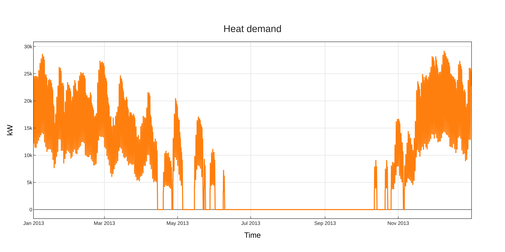
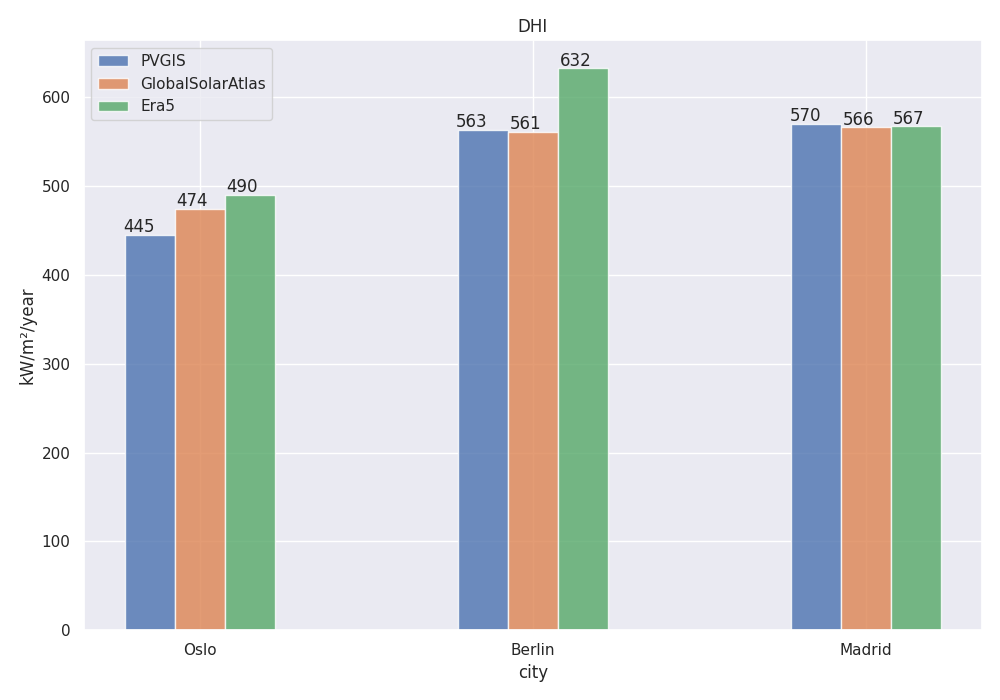
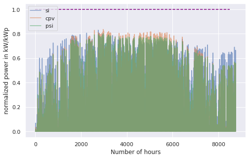
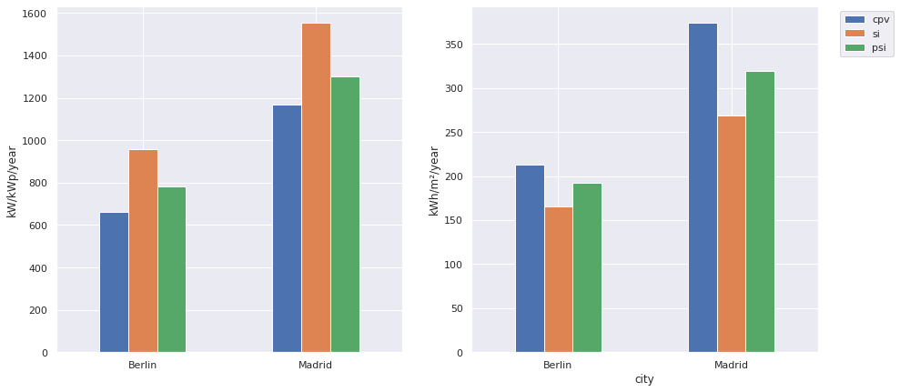
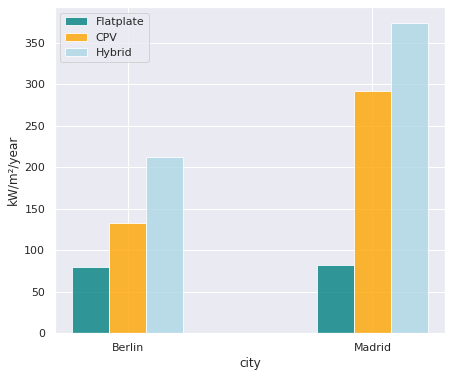

.. _model_assumptions:

Model assumptions
~~~~~~~~~~~~~~~~~

.. _building_assumptions:

Building assumptions
====================

The demand profiles that are introduced in the next sections are based on so called
standard load profiles. These standard load profiles are generated for around 500-1000
Household, therefore the curve is flattened and cannot be compares to the load curve of
a single household. This is why the *pvcompare* simulations are based on *NZE communities*
reather than a single *NZE building*. As a consequence all simulations are run over a
number of 400 identical buildings. In order to interpret the simulation results for
a single building, the total demand / production can be devided by 400. (TODO: is this correct??)

We assume an urban environment that allows high solar exposure without shading
from surrounding buildings or trees.

The stardard building is constructed with a defined building parameters, such as

* length south facade
* length eastwest facade
* total storey area
* hight of storey
* population per storey

All building parameters are defined in 'data/static_inputs/building_parameters.csv'.
The construction of the buidling, as well as the available facades for PV usage
are based on the research of `Hachem, 2014 <https://www.sciencedirect.com/science/article/abs/pii/S0306261913009112>`_.

Exploitation for PV Installation
--------------------------------

It is assumed that PV systems can cover "50% of the south façade
area, starting from the third floor up, and 80% of the east and west
façades." (`Hachem, 2014 <https://www.sciencedirect.com/science/article/abs/pii/S0306261913009112>`_.)
The facades of the first two floors are discarded for PV installation because of
shading.

It is possible to simulate a gable roof as well as a flat roof. For the gable roof it
is assumed that only the south facing area is used for PV installations. Assuming
an elevation of 45°, the gable roof area equals 70% of the total floor area.

For a flat roof area available to PV installations is assumed to be 40% of the
total floor area, due to shading between the modules (see `Energieatlas <https://energieatlas.berlin.de/Energieatlas_Be/Docs/Datendokumentation-Solarkataster_BLN.pdf>`_.

.. _pv-feedin:

PV Modeling
===========
*pvcompare* provides the possibility to calculate feed-in time series for the
following PV technologies under real world conditions:

a) flatplate silicon PV module (SI)
b) hybrid CPV (concentrator-PV) module: CPV cells mounted on a flat plate SI module (CPV)
c) multi-junction perovskite/silicon module (PeroSi)

While the SI module feed-in time series is completely calculated with `pvlib <https://pvlib-python.readthedocs.io/en/stable/index.html>`_ ,
unique models were developed for the CPV and PeroSi technologies. The next
sections will provide a detailed description of the different modeling
approaches.

1. SI
-----
The silicone module parameters are loaded from `cec module <https://github.com/NREL/SAM/tree/develop/deploy/libraries>`_ database. The module
selected by default is the "Aleo_Solar_S59y280" module with a 17% efficiency.
But any other module can be selected.

The time series is calculated by making usage of the `Modelchain  <https://pvlib-python.readthedocs.io/en/stable/modelchain.html>`_
functionality in `pvlib <https://pvlib-python.readthedocs.io/en/stable/index.html>`_. In order to make the results compareable for real world
conditions the following methods are selected from `modelchain object <https://pvlib-python.readthedocs.io/en/stable/api.html#modelchain>`_ :

- aoi_model="ashrae"
- spectral_model="first_solar"
- temperature_model="sapm"
- losses_model="pvwatts"

2. CPV
------

The CPV technology that is used in the *pvcompare* simulations is a hybrid
micro-Concentrator module with integrated planar tracking and diffuse light
collection of the company INSOLIGHT.
The following image describes the composition of the module.

.. _cpv_scheme:

.. figure:: ./images/scheme_cpv.png
    :width: 100%
    :alt: composition scheme of the hybrid module.
    :align: center

    composition scheme of the hybrid module. Direct beam irradiance is
    collected by 1mm III-V cells, while diffuse light is collected by
    the Si cell. For AOI not equal to 0°, the biconvex lens maintains
    a tight but translating focus. A simple mechanism causes the
    backplane to follow the focal point (see `Askins et al., 2019 <https://zenodo.org/record/3349781#.X46UFZpCT0o>`_).

"The Insolight technology employs a biconvex lens designed
such that focusing is possible when the angle of incidence
(AOI) approaches 60°, although the focal spot does travel as the
sun moves and the entire back plane is
translated to follow it, and maintain alignment. The back plane
consists of an array of commercial triple junction microcells
with approximately 42% efficiency combined with
conventional 6” monocrystalline Silicon solar cells. The
microcell size is 1mm and the approximate geometric
concentration ratio is 180X. Because the optical elements are
refractive, diffuse light which is not focused onto the III-V cells
is instead collected by the Si cells, which cover the area not
taken up by III-V cells. Voltages are not matched between III-
V and Si cells, so a four terminal output is provided." (`Askins et al., 2019 <https://zenodo.org/record/3349781#.X46UFZpCT0o>`_)

.. _hybrid_system:

Modeling the hybrid CPV system
^^^^^^^^^^^^^^^^^^^^^^^^^^^^^^
The model of the cpv technology is outsourced from *pvcompare* and can be found in the
`cpvlib <https://github.com/isi-ies-group/cpvlib>`_ repository. *pvcompare*
contains the wrapper function :py:func:`~pvcompare.cpv.apply_cpvlib_StaticHybridSystem.create_cpv_time_series`.

In order to model the dependencies of AOI, temperature and spectrum of the cpv
module, the model follows an approach of `[Gerstmeier, 2011] <https://www.researchgate.net/publication/234976094_Validation_of_the_PVSyst_Performance_Model_for_the_Concentrix_CPV_Technology>`_
previously implemented for CPV in *PVSYST*. The approach uses the single diode
model and adds so called "utilization factors" to the output power to account
losses due to spectral and lens temperature variations.

The utilization factors are defined as follows:

.. math::
    UF = \sum_{i=1}^{n} UF_i \cdot w_i

.. figure:: ./images/Equation_UF.png
    :width: 60%
    :align: center

    ".."

The overall model for the hybrid system is illustrated in the next figure.

.. figure:: ./images/StaticHybridSystem_block_diagram.png
    :width: 100%
    :align: center

    Modeling scheme of the hybrid micro-concentrator module
    (see `cpvlib on github <https://github.com/isi-ies-group/cpvlib>`_).

CPV submodule
^^^^^^^^^^^^^

Input parameters are weather data with AM (air mass), temperature,
DNI (direct normal irradiance), GHI (global horizontal irradiance) over time.
The CPV part only takes DNI into account. The angle of incidence (AOI) is calculated
by `pvlib.irradiance.aoi() <https://pvlib-python.readthedocs.io/en/stable/generated/pvlib.irradiance.aoi.html?highlight=pvlib.irradiance.aoi#pvlib.irradiance.aoi>`_.
Further the `pvlib.pvsystem.singlediode() <https://pvlib-python.readthedocs.io/en/stable/generated/pvlib.pvsystem.singlediode.html?highlight=singlediode>`_ function is solved for the given module parameters.
The utilization factors have been defined before by correlation analysis of
outdoor measurements. The given utilization factors for temperature and air mass
are then multiplied with the output power of the single diode functions. They
function as temperature and air mass corrections due to spectral and temperature
losses.

Flat plate submodule
^^^^^^^^^^^^^^^^^^^^

For AOI < 60° only the diffuse irradiance reaches the flat plate module:
GII (global inclined irradiance) - DII (direct inclined irradiance).
For Aoi > 60 ° also DII and DHI fall onto the flat plate module.
The single diode equation is then solved for all time steps with the specific
input irradiance. No module connection is assumed, so CPV and flat plate output
power are added up as in a four terminal cell.

Measurement Data
^^^^^^^^^^^^^^^^
The Utilization factors were derived from outdoor measurement data of a three
week measurement in Madrid in May 2019. The Data can be found in
`Zenodo <https://zenodo.org/record/3346823#.X46UDZpCT0o>`_ ,
whereas the performance testing of the test module is described in `Askins, et al. (2019) <https://zenodo.org/record/3349781#.X46UFZpCT0o>`_.

2. PeroSi
---------
The perovskite-silicon cell is a high-efficiency cell that is still in its
test phase. Because perovskite is a material that is easily accessible many
researchers around the world are investigating the potential of single junction
perovskite and perovskite tandem cells cells, which we will focus on here.
Because of the early stage of the
development of the technology, no outdoor measurement data is available to
draw correlations for temperature dependencies or spectral dependencies which
are of great impact for multi-junction cells.

Modeling PeroSi
^^^^^^^^^^^^^^^

The following model for generating an output timeseries under real world conditions
is therefore based on cells that were up to now only tested in the laboratory.
Spectral correlations were explicitly calculated by applying `SMARTS <https://www.nrel.gov/grid/solar-resource/smarts.html>`_
(a Simple Model of the Atmospheric Radiative Transfer of Sunshine) to the given
EQE curves of our model. Temperature dependencies are covered by a temperature
coefficient for each sub cell. The dependence of AOI is taken into account
by `SMARTS <https://www.nrel.gov/grid/solar-resource/smarts.html>`_.
The functions for the following calculations can be found in the :ref:`psi` section.

.. figure:: ./images/schema_modell.jpg
    :width: 100%
    :alt: modeling scheme of the perovskite silicone tandem cell
    :align: center

    Modeling scheme of the perovskite silicone tandem cell.

Input data
^^^^^^^^^^

The following input data is needed:

* Weather data with DNI, DHI, GHI, temperature, wind speed
* Cell parameters for each sub cell:
    * Series resistance (R_s)
    * Shunt resistance (R_shunt)
    * Saturation current (j_0)
    * Temperature coefficient for the short circuit current (α)
    * Energy band gap
    * Cell size
    * External quantum efficiency curve (EQE-curve)

The cell parameters provided in *pvcompare* are for the cells (`[Korte2020] <https://pubs.acs.org/doi/10.1021/acsaem.9b01800>`_) ith 17 %
efficiency and (`[Chen2020] <https://www.nature.com/articles/s41467-020-15077-3>`_) bin 28.2% efficiency. For Chen the parameters R_s, R_shunt
and j_0 are evaluated by fitting the IV curve.

Modeling procedure
^^^^^^^^^^^^^^^^^^
1. **weather data**
The POA_global (plane of array) irradiance is calculated with the `pvlib.irradiance.get_total_irradiance() <https://pvlib-python.readthedocs.io/en/stable/generated/pvlib.irradiance.get_total_irradiance.html#pvlib.irradiance.get_total_irradiance>`_ function

2. **SMARTS**
The `SMARTS <https://www.nrel.gov/grid/solar-resource/smarts.html>`_ spectrum is calculated for each time step.

2.1. the output values (``ghi_for_tilted_surface`` and
``photon_flux_for_tilted_surface``) are scaled with the ghi from `ERA5 <https://cds.climate.copernicus.eu/cdsapp#!/dataset/reanalysis-era5-pressure-levels?tab=overview>`_
weather data. The parameter ``photon_flux_for_tilted_surface`` scales linear to
the ``POA_global``.

2.2 the short circuit current (J_sc) is calculated for each time step:

.. math::
    Jsc = \int_\lambda EQE(\lambda) \cdot \Phi (\lambda) \cdot q d\lambda

    \text{with } \Phi : \text{photon flux for tilted surface}

    \text q : \text{elementary electric charge}

3. The `pvlib.pvsystem.singlediode() <https://pvlib-python.readthedocs.io/en/stable/generated/pvlib.pvsystem.singlediode.html?highlight=singlediode>`_
function is used to evaluate the output power of each
sub cell.

3.1 The output power Pmp is multiplied by the number of cells in series

3.2 Losses due to cell connection (5%) and cell to module connection (5%) are
taken into account.

4. The temperature dependency is accounted for by: (see `Jost et al., 2020 <https://onlinelibrary.wiley.com/doi/full/10.1002/aenm.202000454>`_)

.. math::
        Pmp = Pmp - Pmp \cdot \alpha  \cdot (T-T_0)

5. In order to get the module output the cell outputs are added up.

3. Normalization
----------------

For the energy system optimization normalized time series are needed, which can
then be scaled to the optimal installation size (in kWp) of the system.

For normalizing the time series calculated for one PV module, the timeseries is
devided by the p_mp (power at maximum powerpoint) at standard test conditions (STC).
The p_mp of each module can usually be found in the module module sheet.

The normalized timeseries values usually range between 0-1 but can also exceed 1 in case the
conditions allow a higher output than the p_mp at STC. The unit of the normalized
timeseries is kW/kWp.

.. _demand:

Electricity and heat demand modeling
====================================

The load profiles of the demand (electricity and heat) are calculated for a
given population (calculated from number of storeys), a certain country and year.
The profile is generated with the
help of `oemof.demandlib <https://demandlib.readthedocs.io/en/latest/description.html>`_.

Electricity demand
------------------

For the electricity demand, the BDEW load profile for households (H0) is scaled with the annual
demand of a certain population.
Therefore the annual electricity demand is calculated by the following procedure:

1)  the national residential electricity consumption for a country is calculated
    with the following procedure. The data for the total electricity consumprion
    as well as the fractions for space heating (SH), water heating (WH) and cooking
    are requested from `EU Building Database <https://ec.europa.eu/energy/en/eu-buildings-database#how-to-use>`_.

.. math::
    \text{nec} &= \text{tec}(country, year) \\
        &- \text{esh}(country, year) \\
        &- \text{ewh}(country, year) \\
        &+ \text{tc}(country, year) \\
        &- \text{ec}(country, year) \\

    \text{with } nec &= \text{national energy consumption} \\
    \text{tec} &= \text{total electricity consumption} \\
    \text{esh} &= \text{electricity space heating} \\
    \text{ewh} &= \text{electricity water heating} \\
    \text{tc} &= \text{total cookin}g \\
    \text{ec} &= \text{electicity cooking} \\

2)  the population of the country is requested from `EUROSTAT <https://ec.europa.eu/eurostat/tgm/table.do?tab=table&init=1&plugin=1&language=en&pcode=tps00001>`_.
3)  the total residential demand is divided by the countries population and
    multiplied by the house population. The house population is calculated
    by the number of storeys and the number of people per storey.
4)  The load profile is shifted due to country specific behaviour following the
    approach of HOTMAPS. For further information see p.127 in
    `HOTMAPS <https://www.hotmaps-project.eu/wp-content/uploads/2018/03/D2.3-Hotmaps_for-upload_revised-final_.pdf>`_.

Figure `Electricity demand`_ shows an exemplary electricty demand for Spain, 2013.

.. _Electricity demand:

.. figure:: ./images/input_timeseries_Electricity_demand.png
    :width: 100%
    :alt: Energy yield per kWp (left) and per m² (right) for Berlin and Madrid in 2014.
    :align: center

    Exemplary electricty demand for Spain, 2013.

Heat demand
-----------

The heat demand is calculated for a given number of houses with a given
number of storeys, a certain country and year. The BDEW standard load profile
is used. This standard load profile is derived for german households. Because
there is no other standard load profiles available for other countries, the german
standard load profiles is used for all countries as an approximation.

The standard load profile is scaled with the annual heat demand for the given
population. The annual heat demand is calculated by the following procedure:

1)  the residential heat demand for a country is requested from `EU Building Database <https://ec.europa.eu/energy/en/eu-buildings-database#how-to-use>`_. Only the
    Space Heating is used in the simulations (TODO: How to include WH).
2)  on the lines of the electricity demand, the population of the country is requested from `EUROSTAT <https://ec.europa.eu/eurostat/tgm/table.do?tab=table&init=1&plugin=1&language=en&pcode=tps00001>`_.
3)  the total residential demand is divided by the countries population and
    multiplied by the house population that is calculated by the storeys
    of the house and the number of people in one storey
4)  The load profile is shifted due to countries specific behaviour following the
    approach of HOTMAPS. For further information see p.127 in
    `HOTMAPS <https://www.hotmaps-project.eu/wp-content/uploads/2018/03/D2.3-Hotmaps_for-upload_revised-final_.pdf>`_.

Figure `Heat demand`_ shows an exemplary electricty demand for Spain, 2013.

.. _Heat demand:

    Exemplary heat demand for Spain, 2013.

.. _heat-sector:

Heat pump and thermal storage modelling
=======================================

1. Heat pumps and chillers
--------------------------

Different types of heat pumps and chillers can be modelled by adjusting their parameters in ``heat_pumps_and_chillers.csv`` accordingly.

Parameters which can be adjusted and passed are:

  * **mode**: Plant type which can be either ``heat_pump`` or ``chiller``
  * **quality_grade**: Plant-specific scale-down factor to carnot efficiency
  * **temp_high**: Outlet temperature / High temperature of heat reservoir
  * **temp_low** Inlet temperature / Low temperature of heat reservoir
  * **factor_icing**: COP reduction caused by icing (only for heat pumps)
  * **temp_threshold_icing**: Temperature below which icing occurs (only for heat pumps)

Please see the `documentation on compression heat pumps and chillers <https://oemof-thermal.readthedocs.io/en/stable/compression_heat_pumps_and_chillers.html>`_
of `oemof.thermal <https://github.com/oemof/oemof-thermal>`_ for further information.

1.1 Heat pumps
^^^^^^^^^^^^^^

In case of a heat pump **mode**, **quality_grade** and **temp_high** are required values, while passing **temp_low**, **factor_icing** and
**temp_threshold_icing** are optional.

To model an air source heat pump the parameter **temp_low** is passed empty or with *NaN*.
In this case the *COP* will be calculated from the weather data, to be more exact from the ambient temperature.
You can also provide your own time series of temperatures in a separate file as shown in this example of a ``heat_pumps_and_chillers.csv`` file:

.. code-block:: python

    mode,quality_grade,temp_high,temp_low,factor_icing,temp_threshold_icing
    heat_pump,0.35,35,"{'file_name': 'temperature_heat_pump.csv', 'header': 'degC', 'unit': ''}",None,None

(In this example temperatures are provided in ``temperature_heat_pump.csv``, with *degC* as header of the column containing the temperatures.)

To model a water or brine source heat pump, you can either

* pass a time series of temperatures with a separate file as shown in the example below or

    .. code-block:: python

        mode,quality_grade,temp_high,temp_low,factor_icing,temp_threshold_icing
        heat_pump,0.35,35,"{'file_name': 'temperatures_heat_pump.csv', 'header': 'degC', 'unit': ''}",None,None

    (In this example temperatures are provided in ``temperature_heat_pump.csv``, with *degC* as header of the column containing the temperatures.)

* pass a numeric with **temp_low** to model a constant inlet temperature:

    .. code-block:: python

        mode,quality_grade,temp_high,temp_low,factor_icing,temp_threshold_icing
        heat_pump,0.35,35,10,None,None

    (In this example with constant inlet temperature **temp_low**)

1.2 Chillers
^^^^^^^^^^^^

.. warning:: At this point it is not possible to run simulations with a chiller. Adjustments need to be made in ``add_sector_coupling`` function of ``heat_pump_and_chiller.py``.

Modelling a chiller is carried out analogously. Here **mode**, **quality_grade** and **temp_low** are required values,
while passing **temp_high** is optional. The parameters **factor_icing** and **temp_threshold_icing** have to be passed empty or as *NaN* or *None*.

To model an air source chiller the parameter **temp_high** is passed empty or with *NaN*.
In this case the *EER* will be calculated from the weather data, to be more exact from the ambient temperature.
You can also provide your own time series of temperatures in a separate file as in this example of a ``heat_pumps_and_chillers.csv`` file:

.. code-block:: python

    mode,quality_grade,temp_high,temp_low,factor_icing,temp_threshold_icing
    chiller,0.35,"{'file_name': 'temperatures_chiller.csv', 'header': 'degC', 'unit': ''}",15,None,None

(In this example temperatures are provided in ``temperature_chiller.csv``, with *degC* as header of the column containing the temperatures.)

To model a water or brine source chiller, you can either

* provide a time series of temperatures in a separate file as shown in the example below or

    .. code-block:: python

        mode,quality_grade,temp_high,temp_low,factor_icing,temp_threshold_icing
        heat_pump,0.35,"{'file_name': 'temperatures_chiller.csv', 'header': 'degC', 'unit': ''}",15,None,None

    (In this example temperatures are provided in ``temperature_chiller.csv``, with *degC* as header of the column containing the temperatures.)

* pass a numeric with **temp_high** to model a constant outlet temperature:

    .. code-block:: python

        mode,quality_grade,temp_high,temp_low,factor_icing,temp_threshold_icing
        heat_pump,0.35,25,15,None,None

    (In this example with constant outlet temperature **temp_high**)

.. _pv-feedin:

Storage modeling
================
The storage is modeled as a oemof component within MVS. For more information on
how the storage is modeled see `Storage MVS <https://mvs-eland.readthedocs.io/en/latest/Model_Assumptions.html#energy-storage>`_
Possible battery compoenents are: Battery energy storage system (BESS), Thermal energy storage (TES)
and Stratified thermal energy storage (STES).

Validation
==========

Validation of radiation data
----------------------------
The weather data used for simulation is the Copernicus ERA5 reanalysis weather data.
It provides hourly data for atmospheric, land-surface and sea-state parameters with a
latitude-longitude grid of 0.25 x 0.25 degrees resolution. For more information
about the data set see `ERA5 <https://cds.climate.copernicus.eu/cdsapp#!/dataset/reanalysis-era5-pressure-levels?tab=overview>`_.

The calculation of diffuse horizontal irradiance (DHI), direct normal irradiance
(DNI) and global horizontal irradiance (GHI) is based on the ERA5 parameter
'Surface solar radiation downwards' (ssrd). The ssrd describes all radiation (direct
and diffuse in a downward direction and thus is used as the GHI.
Coming from the GHI, the DHI and DNI are calculated the following way:

.. math::
    \text{DHI = GHI - DNI * cos(zenith)}

.. math::
    \text{DNI} = \text{pvlib.irradiance.dirint(GHI, ...)}

With the pvlib function: `pvlib.irradiance.dirint <https://pvlib-python.readthedocs.io/en/stable/generated/pvlib.irradiance.dirint.html#pvlib.irradiance.dirint>`_.

The DHI has been validated for three different locations (Berlin, Madrid and Oslo)
by comparing the ERA5 output to two other weather data sets such as the GlobalSolarAtlas
and PVGIS. Figure `Validation DHI`_ shows the yearly energy yield of DHI for 2014 for the
three locations.

.. _Validation DHI:

    Yearly energy yield of DHI for three locations and three weather data sets for 2014.

The ERA5 data shows higher DHI for northern countries
(Berlin, Oslo), while it is in great accordance with the other data sets for Madrid.
While the offset for Oslo is still in an accepted error margin, the offset for Berlin falls out.
Nevertheless, this offset is accepted in our simulations, because the DHI plays a
secondary role for PV performance.

Validation of PV modeling
-------------------------
In `pv-feedin`_ the models used to generate feed-in time series for SI, CPV and
PSI technologies are presented. This section will show some results of the
calculated time series and discuss model assumptions.

The generated hourly time series over one year are normalized by the peak power
of each module. Figure `PV time series`_ shows an exemplary time series for all
three technologies in year 2014 in Madrid.

.. _PV time series:

    Normalized time series for Madrid, Spain in 2014.

Energy yield
^^^^^^^^^^^^
The size and efficiency of the three modules used age given in `table1`_.

.. _table1:

+------------+-----------------+---------------+
| Technology | Module Size (m) | Efficiency (%)|
+============+=================+===============+
| SI         | 1.6434          | 17            |
+------------+-----------------+---------------+
| CPV        | 0.1             | 32            |
+------------+-----------------+---------------+
| PSI        | 1.219           | 24.5          |
+------------+-----------------+---------------+

Figure `energy yield`_ shows the yearly energy yield per kWp on the left-hand side and the
yearly energy yield per m² on the right-hand side. The plot shows that the production
per kWp is the highest for SI. This is due to a high performance ratio of SI. The lower
performance ratio of Hybrid CPV results in a lower production per kWp.
Nevertheless, when looking at the production per m², the Hybrid CPV technology as well
as the PSI technology perform better than SI, due to it's higher
efficiency (Wp per m²).
Overall, as expected, the yield in Berlin is lower than in Madrid but also the
margin between the technologies
decreases in Berlin. This outcome is due to a  lower direct normal irradiance (DNI) in
Berlin which causes a decrease in the yield of the Hybrid CPV technology.

.. _energy yield:

    Energy yield per kWp (left) and per m² (right) for Berlin and Madrid in 2014.

Hybrid CPV
^^^^^^^^^^

Figure `Hybrid CPV`_ illustrates the energy yield for the different components of the
Hybrid CPV technology. The Flatplate component collects diffuse horizontal irradiance (DHI)
while the CPV components only collects direct normal irradiance (DNI). The Hybrid module
adds up both power outputs of the Flatplate and the CPV part. For more information
about the modeling of Hybrid CPV see `pv-feedin`_.

.. _Hybrid CPV:

    Yearly energy yield of the Hybrid CPV and its components per m² for Berlin and Madrid in 2014.
