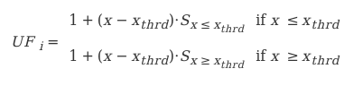
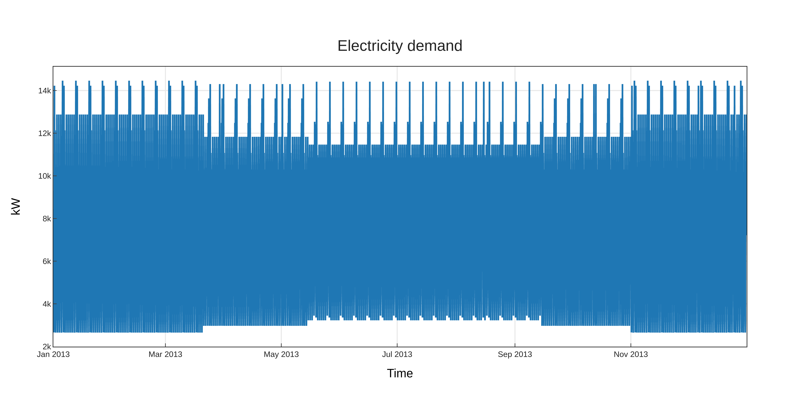

.. _model_assumptions:

Model assumptions
~~~~~~~~~~~~~~~~~

The energy system optimization implemented in *pvcompare* is a linear optimization that minimizes the costs of the
energy system. Depending on the input parameters single components or all components of
the energy system underlie an investment optimization. Certain constraints like a maximum
installed capacity, a maximum amount of greenhouse gas / CO₂ emissions or the requirement
of forming a net zero energy (NZE) *community*, if applied, have to be met.
Check out the `model equations <https://multi-vector-simulator.readthedocs.io/en/v0.5.5/Model_Equations.html#>`_
and `model assumptions <https://multi-vector-simulator.readthedocs.io/en/v0.5.5/Model_Assumptions.html#>`_ of MVS for detailed information.

.. _local_energy_system:

Local energy sytem
==================

.. _building_assumptions:

Building assumptions
--------------------

The analyzed local energy system is assumed to belong to an urban neighbourhood with a specific
number of buildings. A minimum amount of buildings is required when using the functionalities
for calculating demand profiles of *pvcompare*, which are introdcued in :ref:`demand`. They are based on standard load
profiles that are generated for around 500-1000 households. These load profiles are therefore flattened compared to load profiles of
single households.
The amount of buildings, households per storey, number of people per household and further parameters
can be adjusted in the inputs file :ref:`building_parameters`; the default is a number of 20 buildings.

In general we assume an urban environment that allows high solar exposure without shading
from surrounding buildings or trees.

The stardard building is constructed with defined building parameters, such as

* length south façade
* length eastwest façade
* total storey area
* hight of storey
* population per storey

The construction of the buidling, as well as the available façades for PV usage
are based on the research of `Hachem, 2014 <https://www.sciencedirect.com/science/article/abs/pii/S0306261913009112>`_.

The default building parameters are based on the following assumptions that have
been adopted from `Hachem, 2014 <https://www.sciencedirect.com/science/article/abs/pii/S0306261913009112>`_:
Each storey (with a total area of 1232m²) is divided into 8 flats of 120m² each. The rest of the
storey area is used for hallway and staircases etc. Each of the 8 flats is inhabited
by 4 people, meaning in average 30m² per person (it is assumed that a NZE building
is operated efficiently). Therefore the number of persons per storey is set to 32.

All building parameters can be adjusted in the inputs file :ref:`building_parameters`.

Exploitation for PV Installation
--------------------------------

It is assumed that PV systems can cover "50% of the south façade
area, starting from the third floor up, and 80% of the east and west
façades." (`Hachem, 2014 <https://www.sciencedirect.com/science/article/abs/pii/S0306261913009112>`_.)
The façades of the first two floors are discarded for PV installation because of
shading.

It is possible to simulate a gable roof as well as a flat roof. For the gable roof it
is assumed that only the south facing area is used for PV installations. Assuming
an elevation of 45°, the gable roof area facing south equals 70% of the total floor area.

For a flat roof, the area available to PV installations is assumed to be 40% of the
total floor area, due to shading between the modules (see `Energieatlas <https://energieatlas.berlin.de/Energieatlas_Be/Docs/Datendokumentation-Solarkataster_BLN.pdf>`_).

Maximum Capacity
----------------
With the help of the calculated available area for PV exploitation, the maximum
capacity can be calculated. The maximum capacity, given in
the unit of kWp, depends on the size and the efficiency of the specific PV technology.
It serves as a limit (constraint) for the investment optimization.
It is calculated as follows:

.. math::
    \text{maxCap} = ( \text{available area } / \text{module size } ) \cdot \text{module peak power}

.. _pv-feedin:

PV Modeling
===========
*pvcompare* provides the possibility to calculate feed-in time series for the
following PV technologies under real world conditions:

a) flatplate silicon PV module (SI)
b) hybrid CPV (concentrator-PV) module: CPV cells mounted on a flat plate SI module (CPV)
c) multi-junction perovskite/silicon module (PeroSi)

While the SI module feed-in time series is completely calculated with `pvlib <https://pvlib-python.readthedocs.io/en/stable/index.html>`_ ,
unique models were developed for the CPV and PeroSi technologies. The next
sections will provide a detailed description of the different modeling
approaches.

1. SI
-----
The silicone module parameters are loaded from `cec module <https://github.com/NREL/SAM/tree/develop/deploy/libraries>`_ database. The module
selected by default is the "Aleo_Solar_S59y280" module with a 17% efficiency.
But any other module can be selected.

The time series is calculated by making usage of the `Modelchain  <https://pvlib-python.readthedocs.io/en/stable/modelchain.html>`_
functionality in `pvlib <https://pvlib-python.readthedocs.io/en/stable/index.html>`_. In order to make the results compareable for real world
conditions the following methods are selected from `modelchain object <https://pvlib-python.readthedocs.io/en/stable/api.html#modelchain>`_ :

- aoi_model="ashrae"
- spectral_model="first_solar"
- temperature_model="sapm"
- losses_model="pvwatts"

.. _cpv:

2. CPV
------

The CPV technology that is used in the *pvcompare* simulations is a hybrid
micro-Concentrator module with integrated planar tracking and diffuse light
collection of the company INSOLIGHT.
The following image describes the composition of the module.

.. _cpv_scheme:

.. figure:: ./images/scheme_cpv.png
    :width: 100%
    :alt: composition scheme of the hybrid module.
    :align: center

    composition scheme of the hybrid module. Direct beam irradiance is
    collected by 1mm III-V cells, while diffuse light is collected by
    the Si cell. For AOI not equal to 0°, the biconvex lens maintains
    a tight but translating focus. A simple mechanism causes the
    backplane to follow the focal point (see `Askins et al., 2019 <https://zenodo.org/record/3349781#.X46UFZpCT0o>`_).

"The Insolight technology employs a biconvex lens designed
such that focusing is possible when the angle of incidence
(AOI) approaches 60°, although the focal spot does travel as the
sun moves and the entire back plane is
translated to follow it, and maintain alignment. The back plane
consists of an array of commercial triple junction microcells
with approximately 42% efficiency combined with
conventional 6” monocrystalline Silicon solar cells. The
microcell size is 1mm and the approximate geometric
concentration ratio is 180X. Because the optical elements are
refractive, diffuse light which is not focused onto the III-V cells
is instead collected by the Si cells, which cover the area not
taken up by III-V cells. Voltages are not matched between III-
V and Si cells, so a four terminal output is provided." (`Askins et al., 2019 <https://zenodo.org/record/3349781#.X46UFZpCT0o>`_)

.. _hybrid_system:

Modeling the hybrid CPV system
^^^^^^^^^^^^^^^^^^^^^^^^^^^^^^
The model of the cpv technology is outsourced from *pvcompare* and can be found in the
`cpvlib <https://github.com/isi-ies-group/cpvlib>`_ repository. *pvcompare*
contains the wrapper function :py:func:`~pvcompare.cpv.apply_cpvlib_StaticHybridSystem.create_cpv_time_series`.

In order to model the dependencies of AOI, temperature and spectrum of the cpv
module, the model follows an approach of `[Gerstmeier, 2011] <https://www.researchgate.net/publication/234976094_Validation_of_the_PVSyst_Performance_Model_for_the_Concentrix_CPV_Technology>`_
previously implemented for CPV in *PVSYST*. The approach uses the single diode
model and adds so called "utilization factors" to the output power to account
losses due to spectral and lens temperature variations.

The utilization factors are defined as follows:

.. math::
    UF = \sum_{i=1}^{n} UF_i \cdot w_i

    ".."

The overall model for the hybrid system is illustrated in the next figure.

.. figure:: ./images/StaticHybridSystem_block_diagram.png
    :width: 100%
    :align: center

    Modeling scheme of the hybrid micro-concentrator module
    (see `cpvlib on github <https://github.com/isi-ies-group/cpvlib>`_).

CPV submodule
^^^^^^^^^^^^^

Input parameters are weather data with AM (air mass), temperature,
DNI (direct normal irradiance), GHI (global horizontal irradiance) over time.
The CPV part only takes DNI into account. The angle of incidence (AOI) is calculated
by `pvlib.irradiance.aoi() <https://pvlib-python.readthedocs.io/en/stable/generated/pvlib.irradiance.aoi.html?highlight=pvlib.irradiance.aoi#pvlib.irradiance.aoi>`_.
Further the `pvlib.pvsystem.singlediode() <https://pvlib-python.readthedocs.io/en/stable/generated/pvlib.pvsystem.singlediode.html?highlight=singlediode>`_ function is solved for the given module parameters.
The utilization factors have been defined before by correlation analysis of
outdoor measurements. The given utilization factors for temperature and air mass
are then multiplied with the output power of the single diode functions. They
function as temperature and air mass corrections due to spectral and temperature
losses.

Flat plate submodule
^^^^^^^^^^^^^^^^^^^^

For AOI < 60° only the diffuse irradiance reaches the flat plate module:
GII (global inclined irradiance) - DII (direct inclined irradiance).
For Aoi > 60 ° also DII and DHI fall onto the flat plate module.
The single diode equation is then solved for all time steps with the specific
input irradiance. No module connection is assumed, so CPV and flat plate output
power are added up as in a four terminal cell.

Measurement Data
^^^^^^^^^^^^^^^^
The Utilization factors were derived from outdoor measurement data of a three
week measurement in Madrid in May 2019. The Data can be found in
`Zenodo <https://zenodo.org/record/3346823#.X46UDZpCT0o>`_ ,
whereas the performance testing of the test module is described in `Askins, et al. (2019) <https://zenodo.org/record/3349781#.X46UFZpCT0o>`_.

.. _psi:

3. PeroSi
---------
The perovskite-silicon cell is a high-efficiency cell that is still in its
test phase. Because perovskite is a material that is easily accessible many
researchers around the world are investigating the potential of single junction
perovskite and perovskite tandem cells cells, which we will focus on here.
Because of the early stage of the
development of the technology, no outdoor measurement data is available to
draw correlations for temperature dependencies or spectral dependencies which
are of great impact for multi-junction cells.

Modeling PeroSi
^^^^^^^^^^^^^^^

The following model for generating an output timeseries under real world conditions
is therefore based on cells that were up to now only tested in the laboratory.
Spectral correlations were explicitly calculated by applying `SMARTS <https://www.nrel.gov/grid/solar-resource/smarts.html>`_
(a Simple Model of the Atmospheric Radiative Transfer of Sunshine) to the given
EQE curves of our model. Temperature dependencies are covered by a temperature
coefficient for each sub cell. The dependence of AOI is taken into account
by `SMARTS <https://www.nrel.gov/grid/solar-resource/smarts.html>`_.
The functions for the following calculations can be found in the :ref:`psi` section.

.. figure:: ./images/schema_modell.jpg
    :width: 100%
    :alt: modeling scheme of the perovskite silicone tandem cell
    :align: center

    Modeling scheme of the perovskite silicone tandem cell.

Input data
^^^^^^^^^^

The following input data is needed:

* Weather data with DNI, DHI, GHI, temperature, wind speed
* Cell parameters for each sub cell:
    * Series resistance (R_s)
    * Shunt resistance (R_shunt)
    * Saturation current (j_0)
    * Temperature coefficient for the short circuit current (α)
    * Energy band gap
    * Cell size
    * External quantum efficiency curve (EQE-curve)

The cell parameters provided in *pvcompare* are for the cells (`[Korte2020] <https://pubs.acs.org/doi/10.1021/acsaem.9b01800>`_) ith 17 %
efficiency and (`[Chen2020] <https://www.nature.com/articles/s41467-020-15077-3>`_) bin 28.2% efficiency. For Chen the parameters R_s, R_shunt
and j_0 are evaluated by fitting the IV curve.

Modeling procedure
^^^^^^^^^^^^^^^^^^
1. **weather data**
The POA_global (plane of array) irradiance is calculated with the `pvlib.irradiance.get_total_irradiance() <https://pvlib-python.readthedocs.io/en/stable/generated/pvlib.irradiance.get_total_irradiance.html#pvlib.irradiance.get_total_irradiance>`_ function

2. **SMARTS**
The `SMARTS <https://www.nrel.gov/grid/solar-resource/smarts.html>`_ spectrum is calculated for each time step.

2.1. the output values (``ghi_for_tilted_surface`` and
``photon_flux_for_tilted_surface``) are scaled with the ghi from `ERA5 <https://cds.climate.copernicus.eu/cdsapp#!/dataset/reanalysis-era5-pressure-levels?tab=overview>`_
weather data. The parameter ``photon_flux_for_tilted_surface`` scales linear to
the ``POA_global``.

2.2 the short circuit current (J_sc) is calculated for each time step:

.. math::
    Jsc = \int_\lambda EQE(\lambda) \cdot \Phi (\lambda) \cdot q d\lambda

    \text{with } \Phi : \text{photon flux for tilted surface}

    \text q : \text{elementary electric charge}

3. The `pvlib.pvsystem.singlediode() <https://pvlib-python.readthedocs.io/en/stable/generated/pvlib.pvsystem.singlediode.html?highlight=singlediode>`_
function is used to evaluate the output power of each
sub cell.

3.1 The output power Pmp is multiplied by the number of cells in series

3.2 Losses due to cell connection (5%) and cell to module connection (5%) are
taken into account.

4. The temperature dependency is accounted for by: (see `Jost et al., 2020 <https://onlinelibrary.wiley.com/doi/full/10.1002/aenm.202000454>`_)

.. math::
        Pmp = Pmp - Pmp \cdot \alpha  \cdot (T-T_0)

5. In order to get the module output the cell outputs are added up.

3. Normalization
----------------

For the energy system optimization normalized time series are needed, which can
then be scaled to the optimal installation size (in kWp) of the system.

For normalizing the time series calculated for one PV module, the timeseries is
devided by the p_mp (power at maximum powerpoint) at standard test conditions (STC).
The p_mp of each module can usually be found in the module module sheet.

The normalized timeseries values usually range between 0-1 but can also exceed 1 in case the
conditions allow a higher output than the p_mp at STC. The unit of the normalized
timeseries is kW/kWp.

.. _demand:

Electricity and heat demand modeling
====================================

The load profiles of the demand (electricity and heat) are calculated for a
given population (calculated from number of storeys), a certain country and year.
The profile is generated with the
help of `oemof.demandlib <https://demandlib.readthedocs.io/en/latest/description.html>`_.

Electricity demand
------------------

For the electricity demand, the BDEW load profile for households (H0) is scaled with the annual
demand of a certain population.
Therefore the annual electricity demand is calculated by the following procedure:

1)  the national residential electricity consumption for a country is calculated
    with the following procedure. The data for the total electricity consumption
    as well as the fractions for space heating (SH), water heating (WH) and cooking
    are taken from `EU Building Database <https://ec.europa.eu/energy/en/eu-buildings-database#how-to-use>`_.

.. math::
    \text{nec} &= \text{tec}(country, year) \\
        &- \text{esh}(country, year) \\
        &- \text{ewh}(country, year) \\
        &+ \text{tc}(country, year) \\
        &- \text{ec}(country, year) \\

    \text{with } nec &= \text{national energy consumption} \\
    \text{tec} &= \text{total electricity consumption} \\
    \text{esh} &= \text{electricity space heating} \\
    \text{ewh} &= \text{electricity water heating} \\
    \text{tc} &= \text{total cookin}g \\
    \text{ec} &= \text{electicity cooking} \\

2)  the population of the country is taken from `EUROSTAT <https://ec.europa.eu/eurostat/tgm/table.do?tab=table&init=1&plugin=1&language=en&pcode=tps00001>`_.
3)  the total residential demand is divided by the country's population
    and multiplied by the population living in the area considered. The latter is calculated by the product of the
    number of houses, the number of storeys and the number of people per storey (for
    assumptions see :ref:`building_assumptions`).
4)  The load profile is shifted due to country specific behaviour following the
    approach of HOTMAPS. For further information see p.127 in
    `HOTMAPS <https://www.hotmaps-project.eu/wp-content/uploads/2018/03/D2.3-Hotmaps_for-upload_revised-final_.pdf>`_.

Figure `Electricity demand`_ shows an exemplary electricty demand for Spain, 2013.

.. _Electricity demand:

    Exemplary electricty demand for Spain, 2013.

Heat demand
-----------

The heat demand of either space heating or space heating and warm water is calculated for a
given number of houses with a given number of storeys, a certain country and year. In order
to take heat demand from warm water into account the parameter ``include warm water`` in
*pvcompare*'s input file :ref:`building_parameters` is set to ``True``.
To generate the heat demand profiles the BDEW standard load profile is used. This standard
load profile is derived for german households. Because there is no other standard load profile
available for other countries, the german standard load profile is used for all countries as
an approximation. For multiple countries the profile is adapted however by hour shifting.

Due to the characteristics of the sigmoid function used for the calculation of the heat demand
profiles, the heat demand never equals zero. Since this does not correspond to the realistic
behavior of heat supplied by means of space heating in summer, a heating limit temperature is
introduced, above which no heating takes place. The heating limit temperature can be set in
:ref:`building_parameters` and is 15 °C by default. In case of space heating, heat demand
during summer is removed if the daily mean temperature exceeds the heating limit temperature.
The excess heat demand is then distributed equally over the remaining time of the year. In case
of a heat demand from space heating and warm water, only the heat demand of the space heating
is adjusted as described above.

The standard load profile is scaled with the annual heat demand for the given
population, which is derived from the given number of houses and storeys (for assumptions see :ref:`building_assumptions`). The annual heat demand for space heating and warm water is calculated by the
following procedure:

1)  the residential heat demand of a country is taken from the `EU Building Database <https://ec.europa.eu/energy/en/eu-buildings-database#how-to-use>`_.
2)  on the lines of the electricity demand, the population of the country is taken from `EUROSTAT <https://ec.europa.eu/eurostat/tgm/table.do?tab=table&init=1&plugin=1&language=en&pcode=tps00001>`_.
3)  the total residential demand is divided by the country's population
    and multiplied by the population living in the area considered. The latter is calculated by the product of the
    number of houses, the number of storeys and the number of people per storey (for
    assumptions see :ref:`building_assumptions`).
4)  Heat demand that occurs when a daily mean temperature is above the heating limit
    temperature is removed and distributed evenly over the heat demand of the remaining time
    of the year.
5)  For multiple countries, the load profile is adapted by hour shifting following the
    approach of HOTMAPS. For further information see p.127 in
    `HOTMAPS <https://www.hotmaps-project.eu/wp-content/uploads/2018/03/D2.3-Hotmaps_for-upload_revised-final_.pdf>`_.

Figure `Heat demand sh`_ shows an exemplary heat demand for space heating and figure `Heat demand shww`_
the exemplary heat demand from space heating and warm water of Spain, 2013.

.. _Heat demand sh:

.. figure:: ./images/input_timeseries_Heat_demand_sh.png
    :width: 100%
    :alt: Heat demand in kW for space heating in Madrid in 2013.
    :align: center

    Exemplary heat demand for space heating in Madrid, 2013.

.. _Heat demand shww:

.. figure:: ./images/input_timeseries_Heat_demand_shww.png
    :width: 100%
    :alt: Heat demand in kW for space heating and warm water in Madrid in 2013.
    :align: center

    Exemplary heat demand for space heating and warm water in Madrid, 2013.

.. _heat-sector:

Heat pump and thermal storage modelling
=======================================

1. Heat pumps and chillers
--------------------------

Different types of heat pumps and chillers can be modelled by adjusting their parameters in :ref:`HP_parameters` accordingly.

Parameters which can be adjusted and passed are:

  * **mode**: Plant type which can be either ``heat_pump`` or ``chiller``
  * **technology**: Specific technology of the plant type which can  be ``air-air``, ``air-water`` or ``brine-water``
  * **quality_grade**: Plant-specific scale-down factor to carnot efficiency
  * **temp_high**: Outlet temperature / High temperature of heat reservoir
  * **temp_low** Inlet temperature / Low temperature of heat reservoir
  * **factor_icing**: COP reduction caused by icing (only for heat pumps)
  * **temp_threshold_icing**: Temperature below which icing occurs (only for heat pumps)

Please see the `documentation on compression heat pumps and chillers <https://oemof-thermal.readthedocs.io/en/stable/compression_heat_pumps_and_chillers.html>`_
of `oemof.thermal <https://github.com/oemof/oemof-thermal>`_ for further information.

1.1 Heat pumps
^^^^^^^^^^^^^^

In case of a heat pump **mode** and **temp_high** are required values, while passing **temp_low**, **factor_icing** and
**temp_threshold_icing** are optional. Besides either **quality_grade** or **technology** has to be passed.
The quality grade depends on the technology hence you need to provide a specification of the technology if you want to model the asset from default quality grades.
Default values are implemented for the following technologies: air-to-air, air-to-water and brine-to-water.
If you provide your own quality grade, passing **technology** is optional and will be set to an air source technology if passed empty or *NaN*.

To model an air source heat pump, **technology** is to be set to either **air-air** or **air-water** and the parameter **temp_low** is passed empty or with *NaN*.
In case you provide your own quality grade, you do not need to specify the technology, since it will be set to the default: air source technology (**air-air** or **air-water**).
In this case the *COP* will be calculated from the weather data, to be more exact from the ambient temperature.
You can also provide your own time series of temperatures in a separate file as shown in this example of a ``heat_pumps_and_chillers.csv`` file:

.. code-block:: python

    mode,technology,quality_grade,temp_high,temp_low,factor_icing,temp_threshold_icing
    heat_pump,air-water,0.403,"{'file_name': 'temperature_heat_pump.csv', 'header': 'degC', 'unit': ''}",None,None

(In this example temperatures are provided in ``temperature_heat_pump.csv``, with *degC* as header of the column containing the temperatures.)

To model a water or brine source heat pump, you can either

* pass a time series of temperatures with a separate file as shown in the example below or

    .. code-block:: python

        mode,technology,quality_grade,temp_high,temp_low,factor_icing,temp_threshold_icing
        heat_pump,water-water,0.45,"{'file_name': 'temperatures_heat_pump.csv', 'header': 'degC', 'unit': ''}",None,None

    (In this example temperatures are provided in ``temperature_heat_pump.csv``, with *degC* as header of the column containing the temperatures.)

* pass a numeric with **temp_low** to model a constant inlet temperature:

    .. code-block:: python

        mode,technology,quality_grade,temp_high,temp_low,factor_icing,temp_threshold_icing
        heat_pump,brine-water,0.53,50,16,None,None

    (In this example with constant inlet temperature **temp_low**)

To model a brine source heat pump from an automatically calculated ground temperature, **technology** is to be set to **brine-water** and the parameter **temp_low** is passed empty or with *NaN*:

    .. code-block:: python

        mode,technology,quality_grade,temp_high,temp_low,factor_icing,temp_threshold_icing
        heat_pump,brine-water,0.53,50,,None,None

    (In this example without passed inlet temperature **temp_low**)

In this case the *COP* will be calculated from the mean yearly ambient temperature, as an simplifying assumption of the ground temperature according to `brandl_energy_2006 <https://www.icevirtuallibrary.com/doi/full/10.1680/geot.2006.56.2.81>`_

1.2 Chillers
^^^^^^^^^^^^

.. warning:: At this point it is not possible to run simulations with a chiller. Adjustments need to be made in ``add_sector_coupling`` function of ``heat_pump_and_chiller.py``.

Modelling a chiller is carried out analogously. Here **mode** and **temp_low** are required values, while passing **temp_high** is optional.
The parameters **factor_icing** and **temp_threshold_icing** have to be passed empty or as *NaN* or *None*.

The quality grade depends on the technology hence you need to provide a specification of the technology if you want to model the asset from default quality grade.
So far there is only one default value implemented for an air-to-air chiller's quality grade. It has been obtained from `monitored data <https://oemof-thermal.readthedocs.io/en/latest/validation_compression_heat_pumps_and_chillers.html>`_ of the GRECO project.
If you provide your own quality grade, passing **technology** is optional and will be set to an air source technology if passed empty or *NaN*.

To model an air source chiller, **technology** is to be set to **air-air** and the parameter **temp_high** is passed empty or with *NaN*.
In case you provide your own quality grade, you do not need to specify the technology, since it will be set to the default: air source technology (**air-air**).
In this case the *EER* will be calculated from the weather data, to be more exact from the ambient temperature.
You can also provide your own time series of temperatures in a separate file as in this example of a ``heat_pumps_and_chillers.csv`` file:

.. code-block:: python

    mode,technology,quality_grade,temp_high,temp_low,factor_icing,temp_threshold_icing
    chiller,air-air,0.3,"{'file_name': 'temperatures_chiller.csv', 'header': 'degC', 'unit': ''}",15,None,None

(In this example temperatures are provided in ``temperature_chiller.csv``, with *degC* as header of the column containing the temperatures.)

To model a water or brine source chiller, you can either

* provide a time series of temperatures in a separate file as shown in the example below or

    .. code-block:: python

        mode,technology,quality_grade,temp_high,temp_low,factor_icing,temp_threshold_icing
        chiller,water-water,0.45,"{'file_name': 'temperatures_chiller.csv', 'header': 'degC', 'unit': ''}",15,None,None

    (In this example temperatures are provided in ``temperature_chiller.csv``, with *degC* as header of the column containing the temperatures.)

* pass a numeric with **temp_high** to model a constant outlet temperature:

    .. code-block:: python

        mode,technology,quality_grade,temp_high,temp_low,factor_icing,temp_threshold_icing
        chiller,water-water,0.3,25,15,None,None

    (In this example with constant outlet temperature **temp_high**)

2. Stratified thermal storage
-----------------------------

In order to model a stratified thermal energy storage *pvcompare* provides precalculations of this component.
The storage's parameters in :ref:`storage_02.csv`

    - ``installedCap``,
    - ``efficiency``,
    - ``fixed_losses_relative`` and
    - ``fixed_losses_absolute``

can be obtained, if not provided by the user, orientating on the `stratified thermal storage component <https://github.com/oemof/oemof-thermal/blob/dev/src/oemof/thermal/stratified_thermal_storage.py>`__
of `oemof.thermal <https://github.com/oemof/oemof-thermal>`__.

The precalculations are done passing the following input parameters with the file
:ref:`stratTES_parameters`, which is located in the *pvcompare*'s iputs directory:

    - ``height``
    - ``diameter``
    - ``temp_h``
    - ``temp_c``
    - ``s_iso``
    - ``lamb_iso``
    - ``alpha_inside``
    - ``alpha_outside``

Please see :ref:`stratTES_parameters` and the `documentation of oemof.thermal <https://oemof-thermal.readthedocs.io/en/latest/stratified_thermal_storage.html>`__
for further explanations of these parameters. The assumptions made setting these parameters
in *pvcompare*, based on a manufacturer's prototype of a stratified thermal storage, are summed up in
:ref:`stratTES_parameters`.

For further information on how the stratified thermal storage is modeled in the *MVS*, please see the
`documentation of the MVS  <https://multi-vector-simulator.readthedocs.io/en/stable/Model_Assumptions.html#thermal-energy-storage>`__.

2.1 Installed Capacity
^^^^^^^^^^^^^^^^^^^^^^

The calculations are implemented within :ref:`thermal_storage`. For an investment optimization
the height of the storage should be left open and ``installedCap`` should be set to 0 or NaN.
If you do a simulation with a fixed storage capacity, you can either

* set a numeric for ``installedCap``:

    .. code-block:: python

            ,unit,storage capacity,input power,output power
            installedCap,kWh,100,0,0

    (In this example the installed capacity is provided as a numeric within :ref:`storage_02.csv`)

* or use the precalculations with leaving ``installedCap`` open or set to NaN and passing a numeric with the ``height`` parameter:

    .. code-block:: python

            ,unit,storage capacity,input power,output power
            installedCap,kWh,,0,0

    (In this example the installed capacity is left open within :ref:`storage_02.csv`)

    .. code-block:: python

            var_name,var_value,var_unit
            height,2.04,m
            diameter,0.79,m
            temp_h,40,degC
            temp_c,34,degC
            s_iso,100,mm
            lamb_iso,0.03,W/(m*K)
            alpha_inside,4.3,W/(m2*K)
            alpha_outside,3.17,W/(m2*K)

    (In this example the ``height`` is provided as a numeric within :ref:`stratTES_parameters`)

The parameters ``U-value``, ``volume`` and ``surface`` of the storage, which are required to
calculate ``installedCap``, are precalculated as well within :ref:`thermal_storage`.

2.2 Efficiency
^^^^^^^^^^^^^^

The efficiency :math:`\eta` of the storage is calculated as follows:

.. math::
   \eta = 1 - loss{\_}rate

with the parameter ``loss_rate``, which is calculated in :ref:`thermal_storage` using the
function ``calculate_losses`` of *oemof.thermal*. Please see the
`oemof.thermal` `examples <https://github.com/oemof/oemof-thermal/tree/dev/examples/stratified_thermal_storage>`__
and the `documentation  <https://oemof-thermal.readthedocs.io/en/latest/stratified_thermal_storage.html>`__
for further information.

2.3 Fixed losses relative and absolute
^^^^^^^^^^^^^^^^^^^^^^^^^^^^^^^^^^^^^^

Besides the relative thermal loss of storage content within one timestep [-] expressed by the ``loss_rate``,
fixed losses as share of nominal storage capacity [-] and fixed absolute losses independent of storage
content or nominal storage capacity [kWh] can be passed as well (cf. `oemof.thermal's documentation on the stratified thermal storage  <https://oemof-thermal.readthedocs.io/en/latest/stratified_thermal_storage.html>`__).
You can model the stratified thermal storage with fixed thermal losses by either providing

* a numeric value:

    .. code-block:: python

            ,unit,storage capacity,input power,output power
            fixed_thermal_losses_relative,factor,0.001,NA,NA
            fixed_thermal_losses_absolute,kWh,0.00001,NA,NA

    (In this example the fixed thermal losses are provided as a numeric within :ref:`storage_02.csv`)

* your own time series with numeric values:

    .. code-block:: python

            ,unit,storage capacity,input power,output power
            fixed_thermal_losses_relative,factor,"{'file_name': 'my_fixed_losses_relative.csv', 'header': 'no_unit', 'unit': ''}",,
            fixed_thermal_losses_absolute,kWh,"{'file_name': 'my_fixed_losses_absolute.csv', 'header': 'kWh', 'unit': ''}",,

    (In this example the fixed thermal losses are provided as an own time series using CSV files within :ref:`storage_02.csv` with *no_unit* as header of the column with the fixed losses relative and *kWh* as header of the column with the fixed losses absolute)

* or using *pvcompare*'s precalculation as described above:

    .. code-block:: python

            ,unit,storage capacity,input power,output power
            fixed_thermal_losses_relative,factor,"{'file_name': 'None', 'header': 'no_unit', 'unit': ''}",,
            fixed_thermal_losses_absolute,kWh,"{'file_name': 'None', 'header': 'kWh', 'unit': ''}",,

    (In this example the fixed thermal losses are calculated in :ref:`thermal_storage` and written to the field ``'file_name'`` in :ref:`storage_02.csv` with *no_unit* as header of the column with the fixed losses relative and *kWh* as header of the column with the fixed losses absolute)

