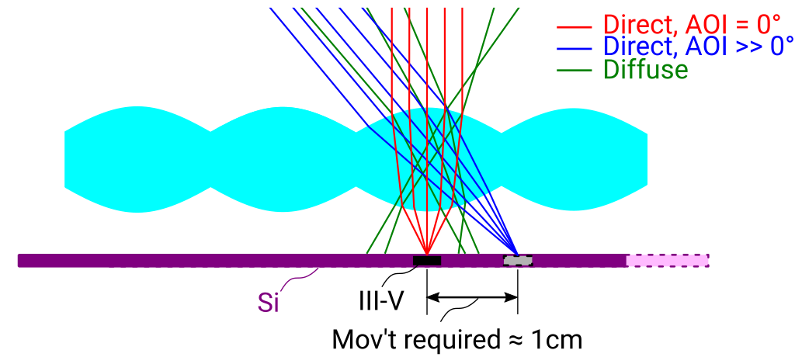
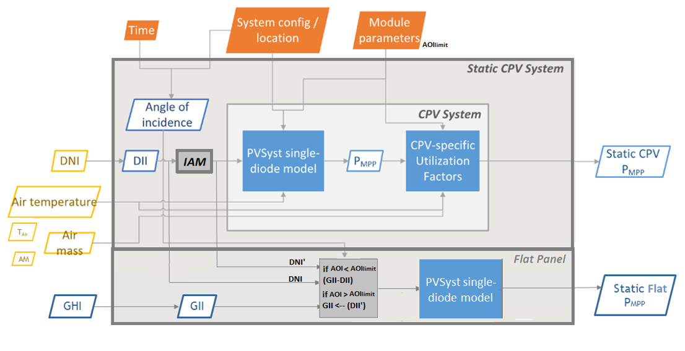
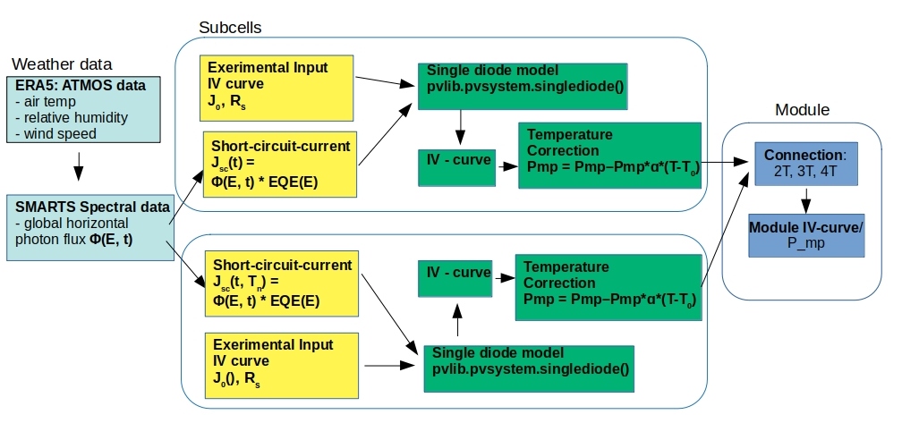

=========================================================
PV feedin - Modeling of different PV Technologies
=========================================================

PVcompare provides the possibility to calculate feedin timeseries for the
following PV technologies under real world conditions:

a) flatplate silicone PV module (SI)
b) a hybrid CPV (concentrator) module mounted on a flatplate SI module (CPV)
c) multijunction perovskite/silicone module (PeroSi)

While the SI module feedin timeseries is completely calculated with `pvlib <https://pvlib-python.readthedocs.io/en/stable/index.html>`_ ,
unique models were developed for the CPV and PeroSi technologies. The next
sections will provide a detailed descriptions of the different modeling
approaches.

------------------
1. SI
------------------
The silicone module parameters are loaded from cec module database. The module
selected by default is the "Aleo_Solar_S59y280" module with a 17% efficiency.
But any other module can be selected.

The timeseries is calculating making usage of the `Modelchain  <https://pvlib-python.readthedocs.io/en/stable/modelchain.html>`_
functionality in `pvlib <https://pvlib-python.readthedocs.io/en/stable/index.html>`_. In order to make the results compareable for real world
conditions the following methods are added to the `modelchain object <https://pvlib-python.readthedocs.io/en/stable/api.html#modelchain>`_ :

- aoi_model="ashrae"
- spectral_model="first_solar"
- temperature_model="sapm"
- losses_model="pvwatts"

-------
2. CPV
-------

The CPV technology that is used in the pvcopare simulations is a hybrid
micro-Concentrator module with integrated planar tracking and diffuse light
collection of the company INSOLIGHT.
The following Image describes the composition of the module:

        collected by 1mm III-V cells, while diffuse light is collected by
        the Si cell. For AOI not equal to 0°, the biconvex lens maintains
        a tight but translating focus. A simple mechanism causes the
        backplane to follow the focal point

"The Insolight technology employs a biconvex lens designed
such that focusing is possible when the angle of incidence
(AOI) approaches 60°, although the focal spot does travel as the
sun moves and the entire back plane is
translated to follow it, and maintain alignment. The back plane
consists of an array of commercial triple junction microcells
with approximately 42% efficiency combined with
conventional 6” monocrystalline Silicon solar cells. The
microcell size is 1mm and the approximate geometric
concentration ratio is 180X. Because the optical elements are
refractive, diffuse light which is not focused onto the III-V cells
is instead collected by the Si cells, which cover the area not
taken up by III-V cells. Voltages are not matched between III-
V and Si cells, so a four terminal output is provided." (From `Askins 2019 <https://zenodo.org/record/3349781#.X46UFZpCT0o>`_)

Modeling the hybrid system
--------------------------
The model of the cpv technology is outsourced from pvcompare and can be found in the
`cpvlib <https://github.com/isi-ies-group/cpvlib>`_ repository. PVcompare
contains the wrapper function `apply_cpvlib_StaticHybridSystem`.

In order to model the dependencies of AOI, temperature and spectrum of the cpv
module, the model follows an approach of `[Gerstmeier, 2011] <https://www.researchgate.net/publication/234976094_Validation_of_the_PVSyst_Performance_Model_for_the_Concentrix_CPV_Technology>`_
Previously implemented for CPV in PVSYST. The approach uses the single diode
model and adds so called "utilization factors" to the output power to account
losses due to spectral and lens temperature variations.

The utilization factors are defined as follows:

.. math::
        UF = \sum_{i=1}^{n} UF_i \cdot w_i

.. math::
        \[
        UF_i =
        \left\{
        \begin{array}{
            @{}% no padding
            l@{\quad}% some padding
            r@{}% no padding
            >{{}}r@{}% no padding
            >{{}}l@{}% no padding
        }
            1 + (x - x_{thrd}) \cdot S_{x\leq x_{thrd}}&         & \text{if }   x &\leq x_{thrd} \\
            1 + (x - x_{thrd}) \cdot S_{x\leq x_{thrd}}&         & \text{if }    x &\geq x_{thrd}
        \end{array}
        \right.
        \]

The overall model for the hybrid system is illustrated in the next figure.

CPV submodule
-------------

Input parameters are weather data with AM (airmass), Temoerature,
DNI (direct normal irradiance), GHI (global horizontal irradiance) over time.
The CPV part only takes DNI into account. The angle of incidence (AOI) is calculated
by `pvlib.irradiance.aoi() <https://pvlib-python.readthedocs.io/en/stable/generated/pvlib.irradiance.aoi.html?highlight=pvlib.irradiance.aoi#pvlib.irradiance.aoi>`_.
Further the `pvlib.pvsystem.singlediode() <https://pvlib-python.readthedocs.io/en/stable/generated/pvlib.pvsystem.singlediode.html?highlight=singlediode>`_ function is solved for the given module parameters.
The utilization factors have been defined before by correlation analysis of
outdoor measurements. The given utilization factors for temperature and airmass
are then multiplied with the output power of the single diode functions. They
function as temperature and airmass corrections due to spectral and temperature
losses.

flatplate submodule
-------------------

For AOI < 60° the flatplate part only takes GII (global inclined irradiance) -
DII (direct inclined irradiance). So only the diffuse part of the irradiance
is considered. For Aoi > 60 ° GII is considered because DII and DHI come through.
The single diode equation is then solved for all timesteps with the specific
input irradiance. No module connection is assumed, so cpv and flatplate output
power are added up as in a four terminal cell.

Measurement Data:
-----------------
The Utilization factors were derived from outdoor measurement data of a three
week measurement in Madrid in May 2019. The Data can be found here
`UPM measurement data <https://zenodo.org/record/3346823#.X46UDZpCT0o>`_ ,
whereas the paper discribing the performance testing of the test module can
be found here `Askins_2019 <https://zenodo.org/record/3349781#.X46UFZpCT0o>`_

------------------
2. PeroSi
------------------
The perovskite silicone cell is a high efficiency cell that is still in it's
test phase. Because perovskite is a material that is easily accessible many
researchers around the world are investigating the potential of perovskite and
tandem e.g perovskite - silicone cells, which we will focus on here.
Because of the early stage of the
development of the technology, no outdoor measurement data is available to
draw correlations for temperature dependencies or spectral dependencies which
are of great impact for multijunction cells.

Modeling PeroSi
---------------

The following model for generating an output timeseries under real world conditions
is therefore based on cells that were up to now only tested in the laboratory.
Spectral correlations were explicitly calculated by applying `SMARTS <https://www.nrel.gov/grid/solar-resource/smarts.html>`_
(a Simple Model of the Atmospheric Radiative Transfer of Sunshine) to the given
EQE curves of our model. Temperature dependencies are covered by a temperature
coefficient for each sub cell. The dependence of AOI is taken into account
by `SMARTS <https://www.nrel.gov/grid/solar-resource/smarts.html>`_.

input data
----------

The following input data is needed:

* weather data with DNI, DHI, GHI, temperature, wind speed
* cell parameters for each subcell:
    * series resistance (Rs)
    * shunt resistance (R_shunt)
    * saturation current (j_0)
    * Temperature coefficient for the short circuit current (α)
    * Energy Bandgap
    * cell size
    * external quantum efficiency curve (EQE-curve)

The cell parameters provided in pvcompare are for the cells (Korte...) ith 17 %
efficiency and (Chen) bin 29% efficiency. For Chen the parameters Rs, R_shunt
and j_0 are found by fitting the IV curve.

modeling procedure
------------------
1. **weather data**
The POA_global (plane of array) irradiance is calculated with `pvlib.irradiance.get_total_irradiance() <https://pvlib-python.readthedocs.io/en/stable/generated/pvlib.irradiance.get_total_irradiance.html#pvlib.irradiance.get_total_irradiance>`_ function

2. **SMARTS**
The `SMARTS <https://www.nrel.gov/grid/solar-resource/smarts.html>`_ spectrum is calculated for each time step

2.1. the output values (ghi_for_tilted surface and
photon_flux_for_tilted_surface) are scaled with the ghi from `ERA5 <https://cds.climate.copernicus.eu/cdsapp#!/dataset/reanalysis-era5-pressure-levels?tab=overview>`_
weather data. The parameter photon_flux_for_tilted_surface scales linear to
the POA_global.

2.2 the short circuit current (Jsc) is calculated for each timestep:

.. math::
        Jsc = \int_\lambda EQE(\lambda) \cdot \Phi (\lambda) \cdot q d\lambda

        \text{with } \Phi : \text{photon flux for tilted surface}

        \text q : \text{elementary electric charge}

3. The `pvlib.pvsystem.singlediode() <https://pvlib-python.readthedocs.io/en/stable/generated/pvlib.pvsystem.singlediode.html?highlight=singlediode>`_
function is used to evaluate the output power of each
subcell.

3.1 The output power Pmp is multiplied by the number of cells in series

3.2 losses due to cell connection (5%) and cell to module connection (5%) are
taken into account

4. The temperature dependency is accounted for by: (see `Jost2020 <https://onlinelibrary.wiley.com/doi/full/10.1002/aenm.202000454>`_)

.. math::
        Pmp = Pmp - Pmp \cdot \alpha  \cdot (T-T_0)

5. In order to get the module output the cell outputs are added up.

----------------
3. Normalization
----------------

For the energy system optimization normalized timeseries are needed, which can
then be scaled to the optimal installation size of the system.

There is three different ways to normalize the PV timeseries.

1) **Normalize by peak power (NP)**

* This procedure takes into account the impacts of the weather on the profile, but not on the scaling of the timeseries

2) **Normalize by p_mp at standard test conditions (power at maximum powerpoint) (NSTC)**

* This procedure accounts for all losses under real world conditions and displays the difference between ideal operation and real world operation

3) **Normalize by p_mp at real world conditions (NRWC)**

* This procedure calculates the maximum powerpoint for realorld conditions at irr_ref = 1000 W/qm and temp_ref = 25 °.

* This way it treats the technology as if it was "ideal" under real world conditions.
* This normalization is of great importance when it comes to estimating technologies that are still under development and do not reach their reference p_mp yet.