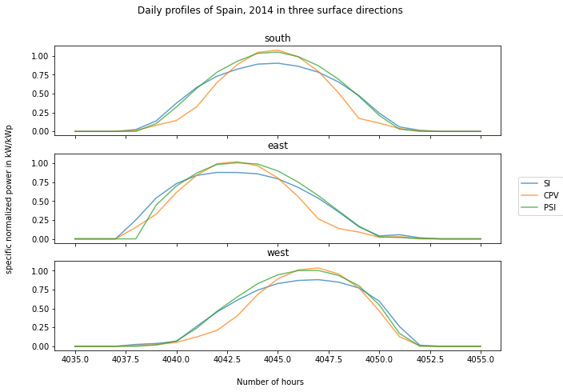
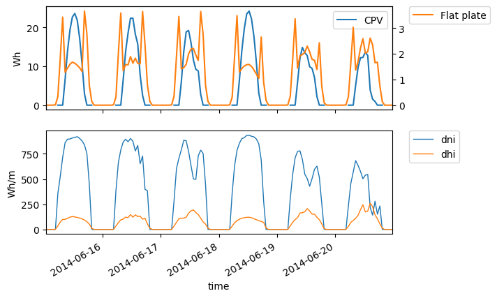

.. _scenarios-results:

GRECO Results
~~~~~~~~~~~~~~~~~~~~~~~~~~~~~~

Here we will publish selected scenarios that we simulated for the H2020 Project GRECO and their results, which will also serve as examples.

Results of PV modeling
-----------------------
In `pv-feedin`_ the models used to generate feed-in time series for SI, CPV and
PSI technologies are presented. This section will show some results of the
calculated time series and discuss model assumptions.

The generated hourly time series over one year are normalized by the peak power
of each module. Figure `PV time series`_ shows an exemplary time series for all
three technologies in year 2014 in Madrid.

.. _PV time series:

.. figure:: ./images/pv_timeseries_madrid_2014.png
    :width: 90%
    :alt: Normalized time series for Madrid, Spain in 2014.
    :align: center

    Normalized time series for Madrid, Spain in 2014.

Figure `Daily Profiles`_ shows the daily profiles of all three technologies. It
demonstrates how the CPV technology has a more narrow profile, because it highly depends
on the DNI. Further, the profile of PSI exceeds the SI profile in the middle of the day.
It can be seen nicely how the profiles are shifted on the east and west facade due
to the solar position. The profiles are specific normalized, meaning that they are
normalized with their maximum value in order to compare them conveniently.

.. _Daily Profiles:

    Daily profiles (specific normalized) of SI, PSI and CPV for south, east and west orientation, Spain in 2014.

Energy yield
^^^^^^^^^^^^
The size and efficiency of the three modules used age given in `table1`_.

.. _table1:

+------------+-----------------+---------------+
| Technology | Module Size (m²) | Efficiency (%)|
+============+=================+===============+
| SI         | 1.6434          | 17            |
+------------+-----------------+---------------+
| CPV        | 0.1             | 32            |
+------------+-----------------+---------------+
| PSI        | 1.219           | 24.5          |
+------------+-----------------+---------------+

Figure `energy yield`_ shows the yearly energy yield per kWp on the left-hand side and the
yearly energy yield per m² on the right-hand side. The plot shows that the production
per kWp is the highest for SI. This is due to a high performance ratio of SI. The lower
performance ratio of Hybrid CPV results in a lower production per kWp.
Nevertheless, when looking at the production per m², the Hybrid CPV technology as well
as the PSI technology perform better than SI, due to it's higher
efficiency (Wp per m²).
Overall, as expected, the yield in Berlin is lower than in Madrid but also the
margin between the technologies
decreases in Berlin. This outcome is due to a  lower direct normal irradiance (DNI) in
Berlin which causes a decrease in the yield of the Hybrid CPV technology.

.. _energy yield:

.. figure:: ./images/PV_energy_yield_2014.png
    :width: 100%
    :alt: Energy yield per kWp (left) and per m² (right) for Berlin and Madrid in 2014.
    :align: center

    Energy yield per kWp (left) and per m² (right) for Berlin and Madrid in 2014.

Hybrid CPV
^^^^^^^^^^

Figure `CPV - Flatplate profile`_ shows the daily production of a single CPV and
Flatplate panel for Spain in 2014. The figure shows how the flatplate produces only in the
morning and the evening, because it is restricted to a solar angle > 60°. The CPV
component has a more narrow peak in the middle of the day, when the DNI has its
maximum.

.. _CPV - Flatplate profile:

    Electricity production of Flatplate and CPV component and irradiance (DHI, DHI) in Madrid, Spain in 2014.

Figure `Hybrid CPV`_ illustrates the energy yield for the different components of the
Hybrid CPV technology. The Flatplate component collects diffuse horizontal irradiance (DHI)
while the CPV components only collects direct normal irradiance (DNI). The Hybrid module
adds up both power outputs of the Flatplate and the CPV part. For more information
about the modeling of Hybrid CPV see `pv-feedin`_.

.. _Hybrid CPV:

.. figure:: ./images/CPV_energy_production.png
    :width: 70%
    :alt: Yearly energy yield of the Hybrid CPV and its components per m² for Berlin and Madrid in 2014.
    :align: center

    Yearly energy yield of the Hybrid CPV and its components per m² for Berlin and Madrid in 2014.
