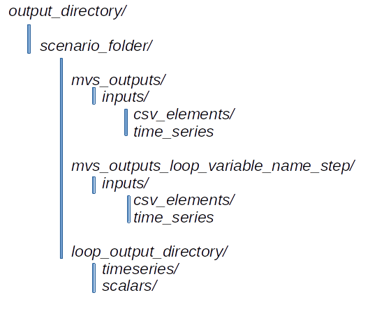
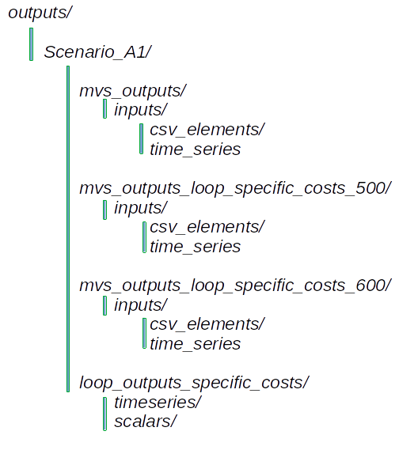

.. _sim-outputs:

Simulation outputs
~~~~~~~~~~~~~~~~~~

The following image shows a schematic figure of how the output structure
of *pvcompare* is composed.

.. _output_structure:

    Composition of the output structure within pvcompare.

For each scenario, a specific output folder with the name `scenario_name` is
created. All outputs are saved into this scenario_folder. When running
:py:func:`~pvcompare.main.apply_mvs` all outputs created by mvs are saved
into the folder `mvs_outputs`. When running :py:func:`~pvcompare.outputs.loop_mvs`
a loop output directory with the additional information of the variable name that
that is looped over, is created. Within this `loop_output_directory` all timeseries
and all scalars are copied into specific folders and named with their specific
looping step. Additionally all mvs_outputs are saved into a folder with the name
`mvs_loop_outputs_variable_name_step', so that the specific steps can be analyzed
easily in separate. For each scenario multiple loops can be applied.

The following image shows an example output directory with specific names of
the folders. In this example the function :py:func:`~pvcompare.main.apply_mvs`
was run. Further one loop for specific costs over two values (500, 600)
was executed.

.. _example_output_structure:

    Example output structure of pvcompare with one loop over specific costs.